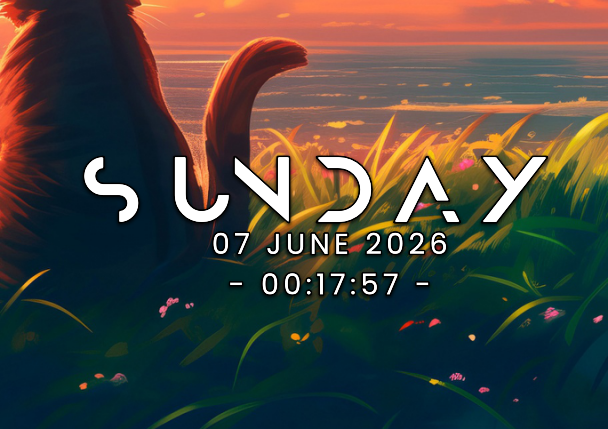
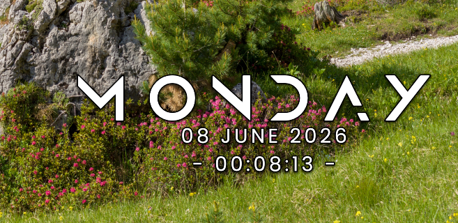
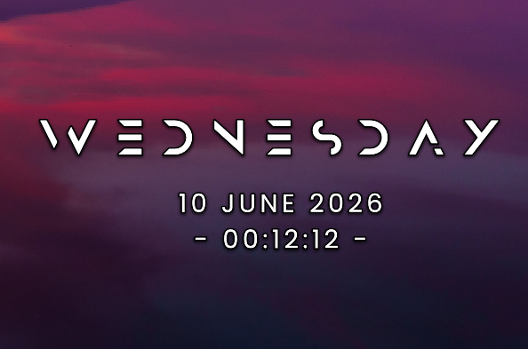
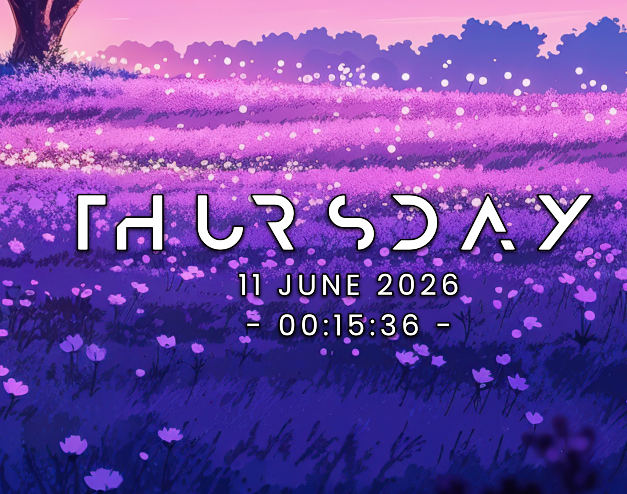
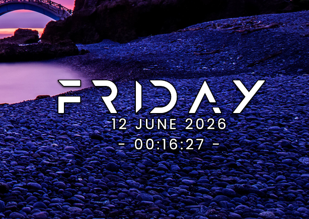
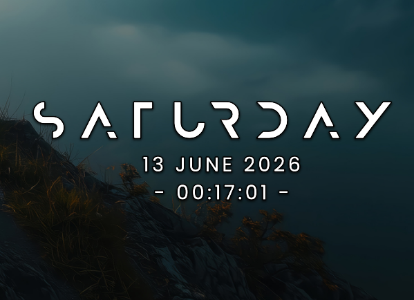

## Better Modern Clock for KDE
A better version of the Modern Clock Widget.

## Features
- **Respecting Custom Tile Size:** The fonts now respect the tile size you have placed it on.
  - It would not increase the width of the widget tile when encountering long day names (like Wednesday or Saturday).
  - It would rather change the size of the font that is going out of bounds.
- **Outline:** Added the option to add, remove, or change the color of the outline at the various parts of the widget.
- **Shadow:** Added the option to add or remove a shadow.
- **Localization Support**: Display day and date names in your local language or keep them in English
  - Toggle "Use local name" for day names (e.g., "SAMSTAG" instead of "SATURDAY")
  - Toggle "Use local name" for date formats with localized month names
- **Customizable Appearance**: Adjust font sizes, letter spacing, and colors for each element
- **Flexible Time Format**:
  - Custom time format field supports Qt patterns (e.g., hh:mm:ss, h:mm:ss AP, HH:mm:ss)
  - Seconds in the format enable 1-second refresh; otherwise refreshes each minute
  - Custom format overrides the 12/24-hour toggle when filled
- **Show/Hide Elements**: Independently control visibility of day, date, and time
- **Custom Style Characters**: Add decorative characters around the time display

## Installation

### Built-in KDE Store
1. Right click on the desktop
2. Click on "Enter Edit Mode"
3. Click on "Add or Manage Widgets"
4. Click on "Get New Widgets"
5. Click on "Download New Plasma Widgets"
6. Search for "Better Modern Clock"
7. Click on "Install" and you're done!

### KDE Store Website
1. Go to - https://store.kde.org/p/2362044
2. Click on "Download" and select the latest version.
3. Right click on the desktop
4. Click on "Enter Edit Mode"
5. Click on "Add or Manage Widgets"
6. Click on "Install Widgets from Local File"
7. Select the file you just downloaded.

### From this repository
1. Clone this repository  
`git clone https://github.com/ProRick2358Y/kde_modernclock && cd kde_modernclock/`  
2. Install using the script  
`kpackagetool6 -i package/ -t Plasma/Applet`

## Credits

This project is a fork of a remake by [v'Karas](https://github.com/vKaras1337) at [Advanced Modern Clock for KDE](https://github.com/vKaras1337/kde_modernclock).

The original is available at [Modern Clock for KDE](https://github.com/prayag2/kde_modernclock) by [Prayag Jain](https://github.com/prayag2). I would like to thank the original author for creating this beautiful open source clock widget.

The localization done by v'Karas was inspired by [JortonMV's fork](https://github.com/JortonMV/kde_modernclock/commit/25b87b540ea7903ab4d72174d2f77888d2a7a909). Thanks for the great idea!

The custom font selection feature added by v'Karas was inspired by [lunar-d's fork](https://github.com/lunar-d/kde_modernclock_fonts/commit/9a881d1e560a2c30c3defde109aaae81fc27baef). Thanks for the implementation!

The custom time format feature added by v'Karas was inspired by [YoannDev90's commit](https://github.com/YoannDev90/kde_modernclock/commit/3a737660982985f1aaf1ede2b374c1d2e4f1b8da), which adds seconds-aware refresh cadence.

Thanks to [UnknownWitcher](https://github.com/UnknownWitcher) for providing a fix for the centered layout that was implemented by v'Karas.

This fork combines these improvements while maintaining the modern and clean design of the original.
